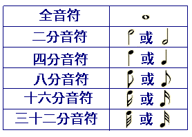
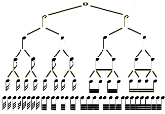
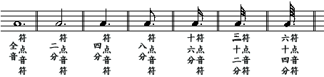
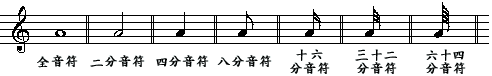
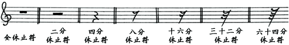

# Music Theory

## 音符

| 符号         | 中文             | 英文                                     |
| ------------ | ---------------- | ---------------------------------------- |
|              | 全音符           | semobreve / whole note                   |
|              | 二分音符         | crotchet / quarter note                  |
| ♩            | 四分音符         | crotchet / quarter note                  |
|              | 八分音符         | quaver / eighth note                     |
| ♬            | 十六分音符       | semiquaver / demiquaver / sixteenth note |
|              | 三十二分音符     | semiquaver / demiquaver / sixteenth note |
|              | 六十四分音符     | sixty-fourth note                        |
|              | 一百二十八分音符 | one hundred and twenty-eighth note       |
|              | 倍全音符         | breve                                    |
|              |                  |                                          |
| ‖            | 双纵线           |                                          |
| 1/2          | 节拍             |                                          |
| ∠            | 渐强             |                                          |
| ⌒            | 连音符           |                                          |
| `‖:` or `:‖` | 小节反复记号     |                                          |
| .            | 附点             |                                          |
| mp           | 中弱             |                                          |
|              |                  |                                          |
| ∮            | 变音记号         |                                          |
| ♯            | 升记号           |                                          |
| ♭            | 降记号           |                                          |
| ×            | 重升记号         |                                          |
| bb           | 重降记号         |                                          |
| ♮            | 还原记号         |                                          |

## 升降號

### 變音符號共有五種

* “#”升號
* “b”降號
* “×”重升號
* “bb”重降號
* “♮”還原號

## 譜號

> 在五線譜上確定音高的位置---也就是音名位置的符號叫做譜號。

* 譜號分別有高音譜號，低音譜號，中音譜號三種

## 音節

> 在計算小節數時，應該以完整小節開始計算

* 小節：音樂總是跌宕起伏，強弱交替出現，這種交替出現不能是雜亂無章的、隨意的，必須按著旋律的結構，組織成最小的、有規律的組織，在這個基礎上進行纔可以。這個最基本的基礎，就是小節。規律是這樣的，強拍和弱拍交替進行，每當一個強拍出來，不管後面跟不跟弱拍（1/4的就沒有弱拍跟在後面）或是有幾個弱拍，在第二個強拍出現之前這即構成了一個小節，當第二個強拍出現之後，又形成第二個小節，這樣循環往復。
* 小節線：每一個小節之間是由小節線來劃分的，小節線是一條條與譜表相垂直的堅線，上面頂到第五線，下面畫到第一線，（上下兩邊切記不可出線，以免與音符混洧。）這樣一條條的縱線就叫“小節線”，小節線把譜表分成一節一節的，從而形成了小節
* 終止線：終止線是在樂曲最後，將要結束的地方，這裡就不能單純的畫小節線，而是要區別一般的小節線來表示，這種表示的方法是用兩條豎線，其中一條細線，一條粗線並行，細的一條在前，粗的一條在後，這叫“終止線”，表明樂曲終了。（終止線的上下兩端也是不可以出線的，要與第一線和第五線對齊）
* 弱起小節：一般情況下，樂曲開頭部分都是從第一小節，第一拍的正拍開始的，這種叫“強拍起小節”，也就是從第一小節的強拍開始。但是還有一種起拍不是由第一小節第一拍的正拍開始而是由第一小節第一拍的後半拍或者是第一小節的末一拍開始，或別的拍開始，總之不是第一小節的正拍開始，都叫“弱起小節”，比如我們大家熟悉的《國際歌》，就是從弱起小節。

## 常見速度記號

| 記號英文    | 記號中文            | 拍數   |
| ----------- | ------------------- | ------ |
| Largo       | 最緩板              | 約 46  |
| Lento       | 緩板                | 約 52  |
| Adagio      | 慢板                | 約 56  |
| Andante     | 行板                | 約 60  |
| Andantino   | 小行板              | 約 66  |
| Moderato    | 中板                | 約 96  |
| Allegretto  | 稍快板              | 約 108 |
| Animato     | 活潑生動 (風格表示) | 約 120 |
| Allegro     | 快板                | 約 132 |
| Vivo        | 甚快板              | 約 160 |
| Presto      | 急板                | 約 184 |
| Prestissimo | 最急板              | 約 208 |
